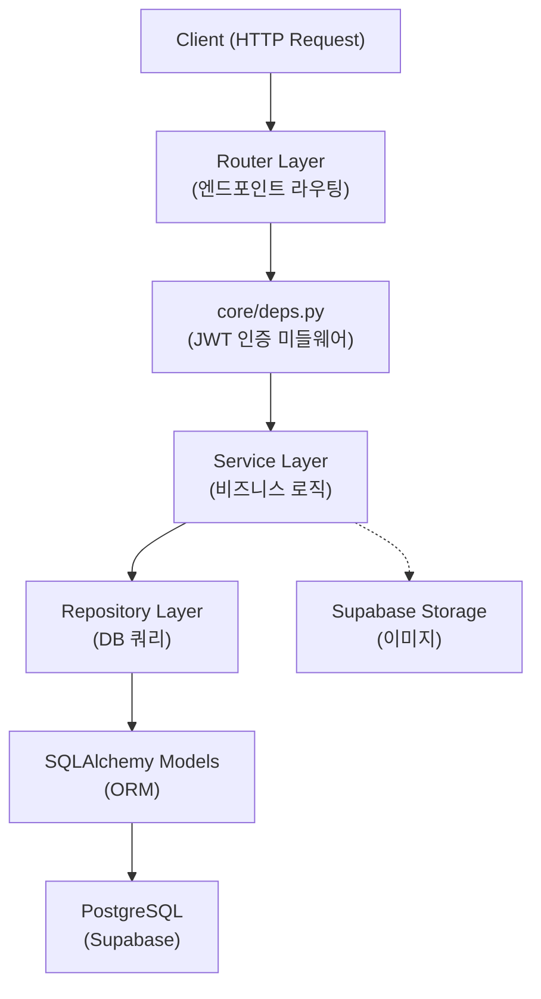
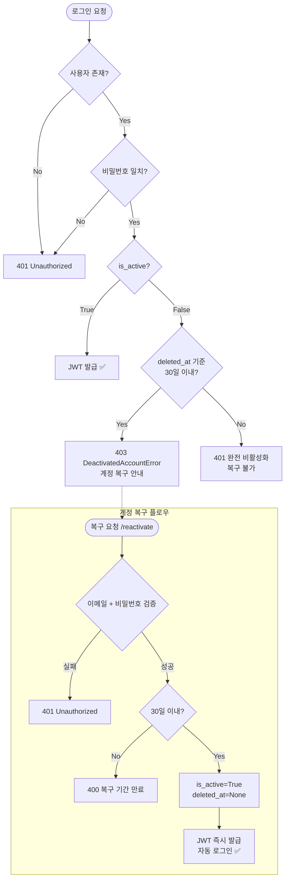
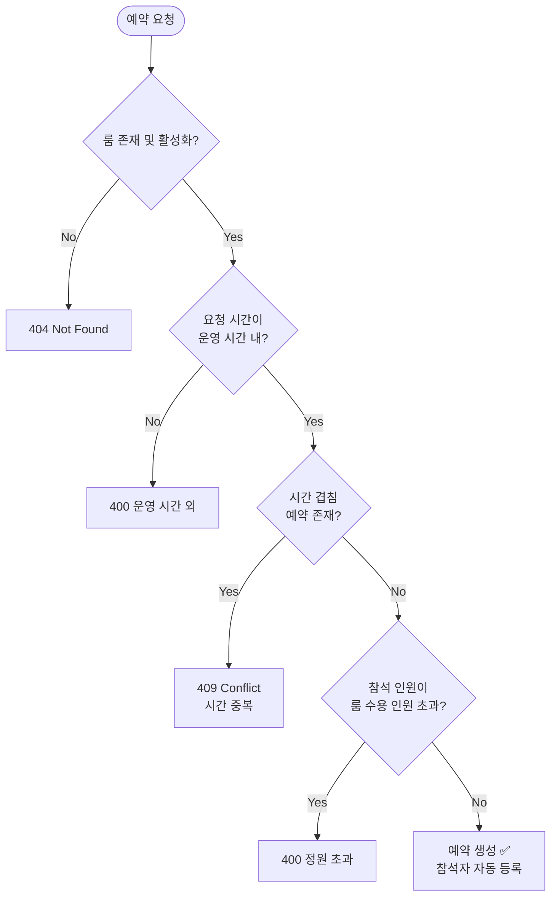

# Study Platform Backend

> **스터디룸 예약 · 커뮤니티 · 스터디 모집**을 한 곳에서 관리하는 FastAPI 기반 스터디 플랫폼 백엔드 API 서버입니다.

[](https://python.org)
[](https://fastapi.tiangolo.com)
[](https://sqlalchemy.org)
[](https://supabase.com)
[](https://jwt.io)
[](http://localhost:8000/docs)

---

## About The Project

이 프로젝트는 스터디 활동을 위한 종합 백엔드 플랫폼입니다. 사용자는 스터디룸을 예약하고, 스터디 모집 게시글을 올리며, 커뮤니티 게시판에서 정보를 공유할 수 있습니다.

**핵심 설계 원칙:**
- **계층형 아키텍처** — Router → Service → Repository → Model의 명확한 책임 분리
- **역할 기반 접근 제어** — `user` / `admin` 두 가지 역할로 API 접근을 관리
- **Soft Delete 계정 관리** — 탈퇴 후 30일 유예 기간 동안 계정 복구 가능
- **Supabase 통합** — PostgreSQL DB와 Storage(이미지 업로드)를 Supabase로 운영

---

## Tech Stack

| 분류 | 기술 |
|---|---|
| **Framework** | FastAPI |
| **ORM** | SQLAlchemy |
| **Database** | PostgreSQL (Supabase) |
| **Authentication** | JWT (`python-jose`), bcrypt (`passlib`) |
| **Storage** | Supabase Storage |
| **Server** | Uvicorn (ASGI) |
| **Validation** | Pydantic v2 |
| **Configuration** | python-dotenv, pydantic-settings |

---

## Key Features

### 회원 관리
- **회원가입 / 로그인** — 이메일 + bcrypt 비밀번호 해싱, JWT Bearer 토큰 발급
- **Soft Delete & 계정 복구** — 탈퇴 요청 시 즉시 삭제하지 않고 `deleted_at` 타임스탬프를 기록. 30일 이내라면 비밀번호 인증 후 계정을 즉시 복구하고 자동 로그인 처리
- **30일 후 자동 하드 삭제** — Supabase pg_cron을 통해 매일 새벽 3시에 유예 기간이 지난 계정을 영구 삭제
- **역할 기반 접근 제어** — `admin` 역할은 스터디룸 생성/수정/삭제 및 룸 설정 변경 권한을 가짐
- **마이페이지** — 내가 쓴 게시글, 댓글, 좋아요한 게시글 목록 조회

### 스터디룸 예약
- **스터디룸 관리** — 룸별 수용 인원, 운영 시간(`open_time`/`close_time`), 예약 단위(`slot_duration`) 설정
- **예약 생성 및 충돌 방지** — 시간 겹침 검증으로 동시 예약 불가
- **그룹 예약** — 스터디 그룹 단위로 예약 가능, 참석자 추가/삭제 기능

### 커뮤니티 게시판
- **게시글 CRUD** — 작성/수정(작성자 권한)/삭제, 제목·내용 검색, 페이지네이션
- **대댓글 지원** — `parent_comment_id`를 통한 계층형 댓글 구조
- **좋아요 토글** — 동일 사용자가 중복 좋아요 불가
- **이미지 업로드** — Supabase Storage 연동, 게시글당 다중 이미지 지원
- **조회수 자동 증가** — 게시글 상세 조회 시 `view_count` 자동 증가

### 스터디 모집
- **모집글 관리** — 제목, 설명, 최대 인원 설정. 상태(`모집중` / `모집완료` / `종료`) 관리
- **신청 및 수락/거절** — 스터디 조장이 신청자를 수락하거나 거절
- **현재 인원 자동 동기화** — 수락 처리 시 `current_members` 자동 증가

### 알림 시스템
- 내 게시글에 댓글이 달리거나, 예약이 처리될 때 알림 생성
- 알림 목록 조회 및 읽음 처리

---

## Directory Structure

```
backend/
├── main.py                   # FastAPI 앱 진입점 및 라우터 등록
├── requirements.txt          # 패키지 의존성
├── .env                      # 환경 변수 (Git 제외)
├── migrations.sql            # DB 초기화 및 pg_cron 설정 스크립트
└── app/
    ├── database.py           # SQLAlchemy 엔진 및 세션 설정
    ├── core/
    │   ├── jwt.py            # JWT 토큰 생성 및 검증
    │   ├── deps.py           # FastAPI 의존성 (인증 미들웨어)
    │   └── exceptions.py     # 커스텀 예외 클래스
    ├── models/               # SQLAlchemy ORM 모델 (DB 테이블 정의)
    │   ├── user.py
    │   ├── study_room.py
    │   ├── room_settings.py
    │   ├── reservation.py
    │   ├── reservation_participant.py
    │   ├── study_group.py
    │   ├── post.py
    │   ├── comment.py
    │   ├── like.py
    │   ├── post_image.py
    │   └── notification.py
    ├── schemas/              # Pydantic 모델 (요청/응답 유효성 검사)
    │   ├── auth.py
    │   ├── user.py
    │   ├── reservation.py
    │   ├── study_group.py
    │   ├── application.py
    │   ├── post.py
    │   ├── comment.py
    │   ├── post_image.py
    │   ├── room.py
    │   ├── notification.py
    │   └── reservation_participant.py
    ├── repositories/         # DB 쿼리 계층 (데이터 접근 로직)
    │   ├── user_repo.py
    │   ├── reservation_repo.py
    │   ├── reservation_participant_repo.py
    │   ├── room_repo.py
    │   ├── room_settings_repo.py
    │   ├── study_group_repo.py
    │   ├── application_repo.py
    │   ├── post_repo.py
    │   ├── comment_repo.py
    │   ├── like_repo.py
    │   ├── post_image_repo.py
    │   └── notification_repo.py
    ├── services/             # 비즈니스 로직 계층
    │   ├── auth_service.py
    │   ├── reservation_service.py
    │   ├── reservation_participant_service.py
    │   ├── room_service.py
    │   ├── room_settings_service.py
    │   ├── study_group_service.py
    │   ├── application_service.py
    │   ├── post_service.py
    │   ├── comment_service.py
    │   ├── post_image_service.py
    │   └── notification_service.py
    └── routers/              # HTTP 엔드포인트 핸들러
        ├── auth.py           # /api/v1/auth
        ├── users.py          # /api/v1/users
        ├── my.py             # /api/v1/my
        ├── notifications.py  # /api/v1/notifications
        ├── rooms.py          # /api/v1/rooms
        ├── reservations.py   # /api/v1/reservations
        ├── reservation_participants.py
        ├── study_groups.py   # /api/v1/groups
        ├── posts.py          # /api/v1/posts
        ├── comments.py       # /api/v1/posts/{post_id}/comments
        └── post_images.py    # /api/v1/posts/{post_id}/images
```

---

## Getting Started

### 1. 저장소 클론

```bash
git clone <your-repo-url>
cd backend
```

### 2. 가상환경 생성 및 활성화

```bash
# 생성
python -m venv .venv

# 활성화 (macOS / Linux)
source .venv/bin/activate

# 활성화 (Windows)
.venv\Scripts\activate
```

### 3. 패키지 설치

```bash
pip install -r requirements.txt
```

### 4. 환경 변수 설정

프로젝트 루트에 `.env` 파일을 생성하고 아래 형식에 맞춰 값을 입력하세요.

```dotenv
# .env.example

# --- Database (Supabase PostgreSQL) ---
DATABASE_URL=postgresql://<user>:<password>@<host>:<port>/<dbname>

# --- JWT Authentication ---
JWT_SECRET_KEY=your_jwt_secret_key_here
JWT_ALGORITHM=HS256
JWT_EXPIRE_MINUTES=60

# --- Supabase Storage (이미지 업로드) ---
SUPABASE_URL=https://<your-project-ref>.supabase.co
SUPABASE_SERVICE_KEY=your_supabase_service_role_key_here
```

> **주의:** `.env` 파일은 절대 Git에 커밋하지 마세요. `.gitignore`에 포함되어 있는지 반드시 확인하세요.

### 5. 데이터베이스 초기화

Supabase SQL Editor 또는 psql을 통해 `migrations.sql`을 실행하여 테이블 및 pg_cron 스케줄을 생성합니다.

```bash
psql $DATABASE_URL -f migrations.sql
```

### 6. 로컬 서버 실행

```bash
uvicorn main:app --reload
```

서버가 정상 시작되면 터미널에 아래와 같은 메시지가 출력됩니다:

```
INFO:     Uvicorn running on http://127.0.0.1:8000 (Press CTRL+C to quit)
INFO:     Started reloader process
```

---

## API Documentation

서버 실행 후 브라우저에서 아래 주소로 접속하면 **Swagger UI**를 통해 모든 API 엔드포인트를 직접 테스트할 수 있습니다.

| 문서 종류 | 주소 |
|---|---|
| **Swagger UI** (인터랙티브 테스트) | http://localhost:8000/docs |
| **ReDoc** (읽기 전용 문서) | http://localhost:8000/redoc |

Swagger UI 우측 상단의 **Authorize** 버튼을 클릭하고 로그인 후 발급된 JWT 토큰을 입력하면, 인증이 필요한 API도 바로 테스트할 수 있습니다.

### API 엔드포인트 요약

| 라우터 | 접두사 | 주요 기능 |
|---|---|---|
| Auth | `/api/v1/auth` | 회원가입, 로그인, 탈퇴, 계정 복구 |
| Users | `/api/v1/users` | 프로필 조회 및 수정 |
| My Page | `/api/v1/my` | 내 게시글, 댓글, 좋아요 목록 |
| Posts | `/api/v1/posts` | 게시글 CRUD, 좋아요, 이미지 업로드 |
| Comments | `/api/v1/posts/{id}/comments` | 댓글 및 대댓글 CRUD |
| Rooms | `/api/v1/rooms` | 스터디룸 관리 및 설정 (관리자) |
| Reservations | `/api/v1/reservations` | 예약 생성, 조회, 취소 |
| Study Groups | `/api/v1/groups` | 스터디 모집, 신청, 수락/거절 |
| Notifications | `/api/v1/notifications` | 알림 조회 및 읽음 처리 |

---

## System Architecture

### 계층형 요청 처리 흐름



---

### 회원 로그인 및 계정 복구 플로우



---

### 스터디룸 예약 플로우


